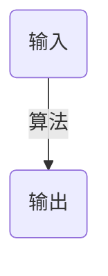

# 第一章 算法在计算中的作用
## 1.1 算法
__算法(algorithm)__ 就是任何良定义的计算过程, 该过程取某个值或值的集合作为 __输入__ 并产生某个值或值的集合作为 __输出__. 这样算法就是把输入转换成输出的计算步骤的一个序列

一个合法的输入序列称为排序问题的一个 __实例(instance)__

算法问题共有的两个特征
1. 存在许多候选解, 但绝大多数候选解都没有解决手头的问题.
2. 存在实际应用

## 1.2 作为一种技术的算法
算法与其他技术
- 先进的计算机体系结构与制造技术
- 易于使用、 直观的图形用户界面(GCU)
- 面向对象的系统
- 集成的万维网技术
- 有线与无线网络的快速组网

# 第二章 算法基础
## 2.1 插入排序
循环不变式性质:
- __初始化__: 循环的第一次迭代之前, 它为真.
- __保持__: 如果循环的某次迭代之前它为真, 那么下次迭代之前它仍为真.
- __终止__: 在循环终止时, 不变式为我们提供一个有用的性质, 该性质有助于证明算法是正确的

__伪代码__ 中的一些约定
- 缩进表示块结构
- for循环每次迭代增加其循环计数器时, 我们使用关键词 __to__. 当一个for循环每次迭代减少其循环计数器时, 我们使用关键词 __downto__
- 符号"//"表示该行后面部分是个注释
- 记号".."用于表示数组中值的一个范围
- 复合数据结构被组织成对象, 对象又由属性组成. 我们使用许多面向对象编程语言中创建的句法来访问特定的属性: 对象名后跟一个点再跟属性名  
  我们把表示一个数组或对象的变量看做指向表示数组或对象的数据的一个指针  
  有时, 一个指针根本不指向任何对象. 这是, 我们赋给它特殊值 __NIL__
- 我们按__值__把参数传递给过程: 被调用过程接受其参数自身的副本. 如果它对某个参数赋值, 调用过程看不到这种改变
- 一个 __return__ 语句立即将控制返回到调用过程的调用点.  
  我们允许在单一的 __return__ 语句中返回多个值
- 布尔运算符"and"和"or"都是 __短路的__
- 关键词 __error__ 表示因为已被调用的过程情况不对而出现了一个错误. 调用过程负责处理该错误, 所以我们不用说明将采取什么行动

## 2.2 分析算法
我们真正感兴趣的是运行时间的 __增长率__ 或 __增长量级__

## 2.3 设计算法
### 2.3.1 分治法
__分治法__ 的思想: 将原问题分解为几个规模较小但类似于原问题的子问题, 递归地求解这些子问题, 然后再合并这些子问题的解来建立原问题的解.
__分治模式__ 在每层递归时都有三个步骤:
- __分解__ 原问题为若干子问题, 这些子问题是原问题的规模较小的实例.
- __解决__ 这些子问题, 递归地求解各子问题. 然而, 若子问题的规模足够小, 则直接求解
- __合并__ 这些子问题的解成原问题的解
